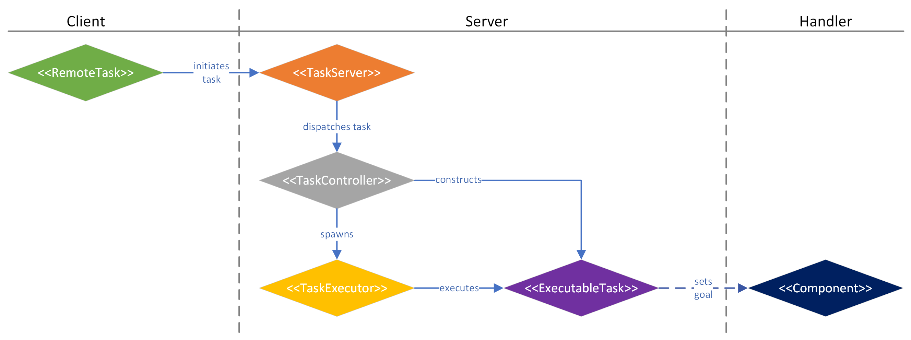
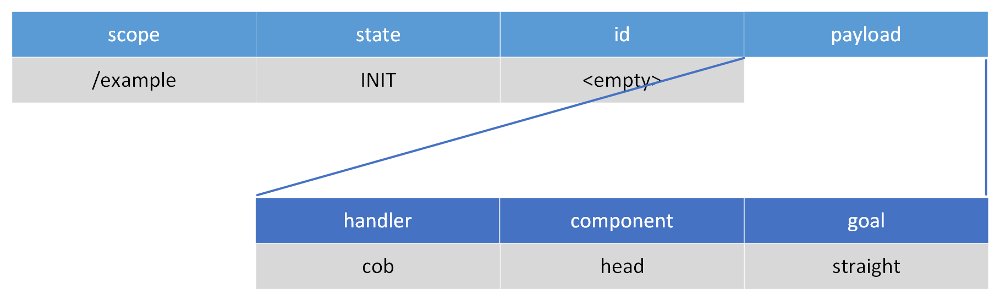

This project contains the `ZTL` library enabling light-weight and widely compatible **remote task execution** using [ZeroMQ](https://zeromq.org/).


# System requirements:

 * ZTL is compatible with all major operating systems running Python and is independent of any specific hardware.
 * ZTL has been tested on Ubuntu versions 16.04, 18.04, 20.04, 22.04, 24.04.
 * ZTL has the following dependencies:
   * [pyzmq](https://pypi.org/project/pyzmq/)
   * [oyaml](https://pypi.org/project/oyaml/)
   * pytest, pytest-xprocess (for testing only)


# Quick usage (modern Ubuntu)

**If you know what you are doing** and operate a modern Ubuntu using Python 3, follow these simple steps for installing ZTL in a virtual environment.
You can then skip the detailled Installation Guide and try the Demo directly.

```bash
sudo apt install python3-pip python3-venv
python3 -m venv ~/ztl
source ~/ztl/bin/activate
pip install ztl
```

# Detailled installation guide

You can easily install and use ZTL in a Python virtual environment in a two-step process.
First, we need to setup the virtual environment and then install the library depending on your preferences.
The process described covers various Ubuntu versions but the library can also be installed and used in Windows using  using slightly different commands.

## Preparing the virtual environment

To create such an environment in your home directory, follow the below steps.
You can install into any existing virtual environment or change the installation folder from ~/ztl to any other folder you prefer.

For modern Ubuntu-based systems using Python 3, the first step is to install the necessary packages and then to create and activate a virtual environment.
Package installation will need administrator rights and might fail. Installation on other operating systems might also vary, but you should make sure to have `pip` and `venv` modules for python ready. 

```bash
sudo apt install python3-pip python3-venv
python3 -m venv ~/ztl
```

For older Ubuntu systems using Python version 2, please use the following steps instead:

```bash
sudo apt install python-pip python-virtualenv
virtualenv ~/ztl
```

No matter which python version, you need to load this environment to be able to use it.
You have to repeat this step for every terminal you want to use the library in:

```bash
source ~/ztl/bin/activate
```

## Installing the library

There are multiple possibilities to install the library on your system.
All are valid alternatives, however, some are restricted to specific Python versions.

### Option 1 (pip)

On modern systems with Python 3, you can simply use pip for installation.
Add the option `--upgrade` to update to the latest version.

```bash
pip install ztl
```

### Option 2 (zip file)

Alternatively, you can download and unpack the source code, independent of your Python version.
Please check the `.zip` file for any subfolders containing the actual files (e.g. when you download from the gitlab repository, it will create a subfolder called `ztl-main`).

```bash
unzip /path/to/ztl.zip -d ~/ztl-src
pip install ~/ztl-src
```

### Option 3 (repository)

You can also clone the repository directly and install the latest sources, independent of your Python version.
If you replace `main` with a branch or tag, you can install specific versions.

```bash
pip install git+https://gitlab.com/robothouse/rh-user/ztl@main
```

# Demo

To test the correct installation of ZTL, you can use the following steps.
Please remember to activate the virtual environment for each terminal.

```bash
source ~/ztl/bin/activate
```

## Simple client-server communication

First, spawn an example server listening on port 12345 and the scope `/test`:

```bash
ztl_task_server -p 12345 -s /test
```

The output confirms that the server component is listening at the specified port and spawns a controller to handle tasks on scope `/test`:

```bash
INFO:remote-task:Task Server listening at 'tcp://*:12345'
INFO:remote-task:Registering controller for scope '/test'.
```

In a different terminal (you need to activate the virtual environment in this terminal first), call the server at the same port on the local machine referred to as `localhost` under the same scope `/test` using a client to see how it replies:

```bash
ztl_task_client -r localhost -p 12345 -s /test some-handler:executing-component:goal-state
```

The output shows successful connection with the server, but the creation of a remote task was rejected because no handler with the name `some-handler` was found:

```bash
Connecting to host 'localhost:12345' at scope '/test'...
INFO:remote-task:Remote task interface initialised at 'tcp://localhost:12345'.
Triggering task with request 'c29tZS1oYW5kbGVyOmV4ZWN1dGluZy1jb21wb25lbnQ6Z29hbC1zdGF0ZQ=='...
Task '-1' could not be triggered: 'Controller threw exception: No such handler 'some-handler', try 'test'.'.
```

Now, the example `task_server` implemented in `ztl` only provides a handler with the name `test` as indicated by the reply above. This test server will handle calls to three different components, i.e. `echo`, `print`, and `sleep`. You can test them as follows:

```bash
ztl_task_client -r localhost -p 12345 -s /test test:echo:"hello world"
```

This time around, the server replies with a `COMPLETED` task that echoes what we have provided as a goal:

```bash
Connecting to host 'localhost:12345' at scope '/test'...
INFO:remote-task:Remote task interface initialised at 'tcp://localhost:12345'.
Triggering task with request 'dGVzdDplY2hvOmhlbGxvIHdvcmxk'...
Initialised task with ID '2' for -1s. Reply is 'Initiated task '2' with request: {'handler': 'test', 'component': 'echo', 'goal': 'hello world'}'.
Task with ID '2' finished in state 'COMPLETED' while waiting. Result is 'hello world'.
```

The reply that the client receives indicates that the server has successfully initialised a task and given it the ID 2.
After completion of the task, the client receives a completion message containing the result, in this case echoing the goal.
If we now look back at the server side, we find that the server does not show any output, meaning that it is working as intended. If you try the `print` component or increase the log level, results should be different, revealing inner states of the protocol.

## Scripting example

To test the scripting interface, you can use the configurations provided in the [example](src/ztl/example/) folder (Note: these are not installed using `pip` but are part of the source code package). First, we need to start a task server, for which one of the example servers is sufficient as it provides all the necessary communication with the scripting engine. Please remember to activate the virtual environment for each terminal.

```bash
ztl_task_server -p 7779 -s /test
```

Next, download the example configuration and script files if you do not have them yet.

```bash
git clone https://gitlab.com/robothouse/rh-user/ztl ~/ztl-src
```

Run the sample scripts:

```bash
cd ~/ztl-src/src/ztl/example/
ztl_run_script -c sample_conf.yaml -s sample_script.yaml
```

Will lead to the following output:

```bash
----------------------------
ABOUT TO EXECUTE SCENE 'scene'
STEP: first step
        test [print]: -> test me
        test [sleep]: -> 5
STEP: second step
        test [echo]: -> another test
PRESS <ENTER> TO CONFIRM or ANY OTHER KEY TO SKIP
```

You can now trigger the example scene by pressing `ENTER`, which will execute a single scene consisting of two steps in sequence, both calling the handler with the name `test`, which we started above. You can also skip the scene to finish the script immediately. Again, the server will only output the messages given to the print component. You can modify the script to call multiple handlers in each step but you have to configure them in the file `sample_conf.yaml` and start another `ztl_task_server` to match this configuration.

# Instructions for use

To implement your own server in Python, you can use the following as an example. This code, however, will reject any task and never execute the `status()` or `abort()` functions since the task is never initialised correctly. For a slightly longer working example including an executable task, refer to [task_server.py](src/ztl/example/task_server.py) in the examples.

```python
from ztl.core.task import TaskController
from ztl.core.protocol import State
from ztl.core.server import TaskServer

class NoneController(TaskController):

    def init(self, request):
        return -1, "Not implemented"


    def status(self, mid, request):
        return State.FAILED, "Not implemented"


    def abort(self, mid, request):
        return State.REJECTED, "Not implemented"

server = TaskServer(12345)
server.register("/test", NoneController())
server.listen()
```

A client to trigger the above server can be implemented as follows:

```python
from ztl.core.client import RemoteTask
from ztl.core.protocol import State, Task

task = RemoteTask("localhost", 12545, "/test")
request = Task.encode("some-handler", "executing-component", "goal-state")
task_id, reply = task.trigger(request)
```

# Architecture overview

The basic communication principle is as follows:



Thereby, each task has the following lifecycle:


An example communication could look like this:

Request:



Reply:


